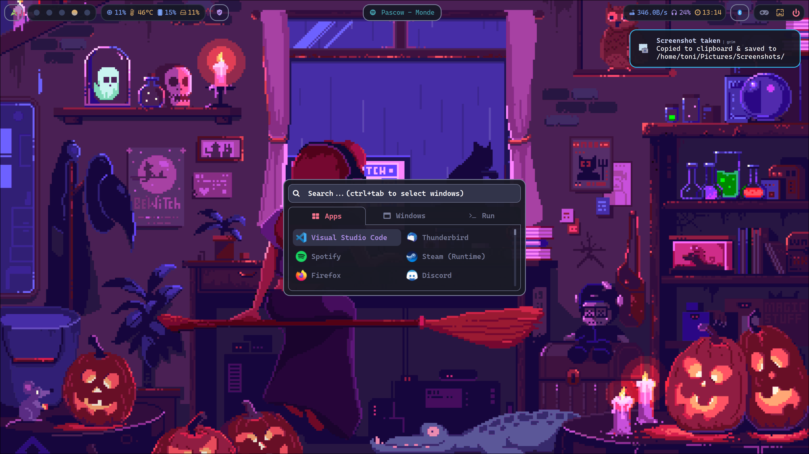

<div align="center">
    
</div>

<div align="center">
    
    <br>
    <a href="https://git.io/typing-svg"></a>
</div>

## 🎨 Impressions

<p align="center">
<center><kbd></kbd></center><center><kbd></kbd></center>
</p>

## 🔥 To Do's

- [ ] Include cava into Spotify meta data

## 📖 Overview

<details open>
<summary><b>🔬 Display</b></summary>

>
<!-- Get some vertical space -->
<center>

🔹 Display Server: [Wayland](https://wiki.archlinux.org/title/Wayland)
🔹 Compositor: [Hyprland](https://hyprland.org/)
🔹 Bar: [Waybar](https://github.com/Alexays/Waybar)
</center>
</details>

<details open><summary><b>🌈 Appearance</b></summary>

>
<!-- Get some vertical space -->

🔸 Color scheme: [Tokyonight-Dark-BL-LB](https://github.com/Fausto-Korpsvart/Tokyo-Night-GTK-Theme)
🔸 Cursor: [Catppuccin-Mocha-Light-Cursors](https://github.com/catppuccin/cursors)
🔸 Icons: [Win 11 icon theme](https://www.gnome-look.org/p/1546069)
</details>

<details open><summary><b>💾 Applications</b></summary>

>
<!-- Get some vertical space -->

</details>

<details open><summary><b>🚗 Ricing</b></summary>

>
<!-- Get some vertical space -->

</details>


## 🥼 Installation

<details><summary> Setting up a fresh Arch Linux</summary>

>
<!-- Get some vertical space -->

After booting into the Live Environment use [archinstall](https://wiki.archlinux.org/title/archinstall) or do it manually with the [installation guide](https://wiki.archlinux.org/title/installation_guide).

> **Note**: It is highly recommended to refer to the official [installation guide](https://wiki.archlinux.org/title/archinstall) and [general recommendations](https://wiki.archlinux.org/title/General_recommendations).

```sh
pacman -Sy archlinux-keyring  # may be needed? not sure anymore.
pacman -Sy archinstall
archinstall  # configure installation and wait for it
```
w
</details>

At first, the [pacman package manager](https://wiki.archlinux.org/title/pacman) needs to be prettied up.

```sh
sudo vim /etc/pacman.conf
# Uncomment the following
ParallelDownloads = 10
Color
# Add the following (must be under [options])
ILoveCandy
```

Installation of an [AUR Helper](https://wiki.archlinux.org/title/AUR_helpers), here [Yay](https://aur.archlinux.org/packages/yay).

```sh
sudo pacman -S base-devel git vim
cd /opt
sudo git clone https://aur.archlinux.org/yay.git
sudo chown -R USERNAME:USERNAME ./yay
cd yay
makepkg -si
```

[Installation](https://wiki.hyprland.org/Getting-Started/Installation/) of [Hyprland](https://hyprland.org/) via [Yay](https://aur.archlinux.org/packages/yay). [Kitty](https://sw.kovidgoyal.net/kitty/) is the default terminal application, that can be launch by `MOD + Q`.

```sh
sudo pacman -Sy kitty
yay -Sy hyprland-git
Hyprland  # start Hpyrland from the tty
```

Clone repository and install all dependencies.

```sh
cd Downloads
git clone https://github.com/tonigineer/.dotfiles.git
cd .dotfiles

yay -S - < packages.lst
```

Link files and do all the other stuff needed.

```sh
./install.sh
```

Final configuration steps.

```sh
# TODO: must be moved into installation script
# Set default terminal in nemo
gsettings set org.cinnamon.desktop.default-applications.terminal exec alacritty

# Set up common user folder - https://command-not-found.com/xdg-user-dir
xdg-user-dirs-update
```

## ⚙ Customization explanation

Trying to explain, how to change the general look of this Rice. This is kind of a reminder/wiki for myself.

<details><summary><b>Fonts</b></summary>

>
<!-- Get some vertical space -->

Fonts can be installed via [Yay](https://aur.archlinux.org/packages/yay) directly from the [AUR](https://aur.archlinux.org/). For example: [Split Package Details - nerd-fonts (any)](https://archlinux.org/packages/community/any/nerd-fonts/)

```sh
yay -Sy otf-cascadia-code-nerd
fc-cache -v  # to update fonts.
```

Installed fonts can be found via:

```sh
fc-list | grep Cas*
Caskaydia Cove Nerd Font Complete Bold Italic.otf: CaskaydiaCove Nerd Font:style=Bold Italic
```

> **Note**: In the example above `CaskaydiaCove Nerd Font` is th name of the font, that needs to be used in configuration files.

</details>

<details><summary><b>Themes, Icons, Cursor</b></summary>

>
<!-- Get some vertical space -->

The `/scripts/apply_theme.sh` from this repo can be used to apply a downloaded theme.

```sh
yay -Sy plank-theme-tokyo-night

sh /scripts/apply_theme.sh theme list  # shows all installed themes
sh /scripts/apply_theme.sh theme THEME-NAME
```

</details>

## 🛠️ Fixes, settings and more

Some applications need further fixes. Especially, `fractional scaling` on [Wayland](https://pointieststick.com/2022/12/16/this-week-in-kde-wayland-fractional-scaling-oh-and-we-also-fixed-multi-screen/) does not work for every application so well. An application looks kind of blurry and/or some does not apply a 4K resolution, e.g., not available in [Steam](https://wiki.archlinux.org/title/steam) games.

<details><summary><b>Bluetooth</b></summary>

>
<!-- Get some vertical space -->

How to configure Bluetooth:

```sh
sudo pacman -S bluez bluez-utils

lsmod | grep btusb  # check if bluetooth module is loaded (should appear on list)
modprobe btusb # exec if not loaded

systemctl enable bluetooth.service
```

```sh
bluetoothctl

power on
agent on  # automatically connect trusted devices
default-agent

scan on
devices

trust <MAC-ADDRESS>  # tab completion :)
pair <MAC-ADDRESS>
connect <MAC-ADDRESS>
```

Enable autostart bluetooth by uncommenting `AutoEnable=true` in

```sh
vim /etc/bluetooth/main.conf
```

</details>

<details><summary><b>Discord</b></summary>

>
<!-- Get some vertical space -->

> **Note**: It's the same as with `Visual Studio Code` down below.

To get rid blurred Discord on [Wayland](https://wayland.freedesktop.org/), start with following arguments:

```sh
discord --enable-features=UseOzonePlatform --ozone-platform=wayland
```

Here a command line to edit `/usr/share/applications/discord.desktop` accordingly:

```sh
# Not sure anymore if --unit-launch is by default in discord.desktop
sudo sed -i 's/discord --unity-launch %F/discord --enable-features=UseOzonePlatform --ozone-platform=wayland/' /usr/share/applications/discord.desktop
```

</details>

<details><summary><b>Spotify</b></summary>

>
<!-- Get some vertical space -->

To get rid of a blurred [Spotify](https://aur.archlinux.org/packages/spotify) on [Wayland](https://wayland.freedesktop.org/), install the following:

```sh
yay -S spotify-blur-me-not
```

</details>

<details><summary><b>Sound</b></summary>

>
<!-- Get some vertical space -->

Getting sound set up:

```sh
sudo pacman -Syu pulseaudio pulseaudio-bluetooth pavucontrol
pulseaudio --start
```

> **Note:** Use `pavucontrol` to start PulseAudio GUI.

</details>

<details><summary><b>Steam</b></summary>

>
<!-- Get some vertical space -->

> **Note**: First of all, great [tutorial](https://steamcommunity.com/sharedfiles/filedetails/?l=german&id=1787799592) on how to set up gaming on [Steam](https://wiki.archlinux.org/title/steam).

### Missing 4K resolution

Currently, there is no cure for [Steam](https://wiki.archlinux.org/title/steam). The only thing I came up with, is to set the scaling back to `1` via:

```sh
way-displays -s SCALE "DP-1" 1
```

There is a button on the [Waybar](https://github.com/Alexays/Waybar) to activate `gamemode`. This script also takes care of some Hyprland stuff. Further information can be found within the script [itself](/user-home-folder/.config/hypr/scripts/gamemode.sh).

### Gamemod

[Gamemode](https://github.com/FeralInteractive/gamemode) can be used to get more performance for games.

```sh
gamemodedrun supertuxkart
```

### cpupower

To get all tests passed in `gamemoded -t`, [cpupower](https://wiki.archlinux.org/title/CPU_frequency_scaling#cpupower) can be used to adapt governor.

```sh
sudo vim `/etc/default/cpupower`
```

```vim
# Define CPUs governor
# valid governors: ondemand, performance, powersave, conservative, userspace.
governor='ondemand'
```

[cpupower](https://wiki.archlinux.org/title/CPU_frequency_scaling#cpupower) service must be started/enabled afterwards.

```sh
systemctl start cpupower.service
# or
systemctl enable cpupower.service
```

> I didn't go for `performance`, because the cooling was working at max. I think, `ondemand` should suffice.

</details>

<details><summary><b>Visual Studio Code</b></summary>

>
<!-- Get some vertical space -->

To get rid of the [blurred Visual Studi Code](https://www.reddit.com/r/Fedora/comments/wpkws3/blurry_vscode_on_wayland_fractional_scaling/) on [Wayland](https://wayland.freedesktop.org/), start with the following arguments:

```sh
code --enable-features=UseOzonePlatform,WaylandWindowDecorations --ozone-platform=wayland
```

Here a command line to edit `/usr/share/applications/code.desktop` accordingly:

```sh
sudo sed -i 's/code --unity-launch %F/code --enable-features=UseOzonePlatform,WaylandWindowDecorations --ozone-platform=wayland/' /usr/share/applications/code.desktop
```

> **Note**: Changes to `code.desktop` are always reverted with updates.

</details>

<details><summary><b>way-displays</b></summary>

>
<!-- Get some vertical space -->

> **Note**: The use of [way-displays](https://github.com/alex-courtis/way-displays) is currently only needed to easily switch the `fractional scaling` and arrange two monitors correctly with scaling (Hyprland does in wrong order). If those things are fixed within [Hyprland](https://hyprland.org/)/[Wayland](https://wayland.freedesktop.org/), this tool is obsolete.

[Command line documentation](https://github.com/alex-courtis/way-displays/blob/master/doc/CONFIGURATION.md#command-line)

</details>
